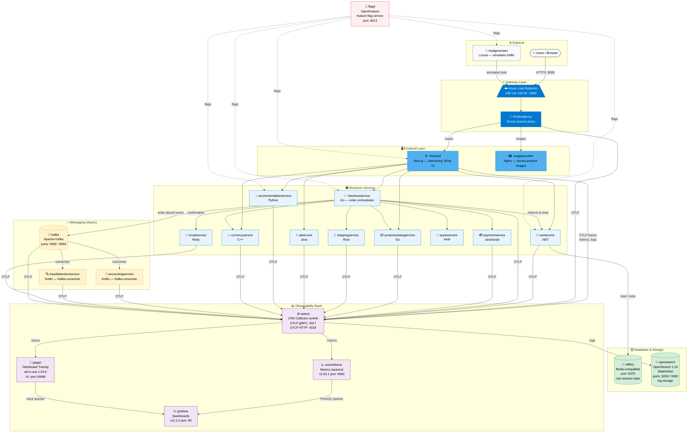

# OpenTelemetry Demo — AKS Deployment Architecture

> Open this file in VSCode and press `Ctrl+Shift+V` to see the rendered diagram.

---

## Component Count Summary

| Layer | Components | Count |
|---|---|---|
| Gateway | Azure Load Balancer, Envoy (frontendproxy) | 2 |
| Frontend | Next.js frontend, Nginx imageprovider | 2 |
| Business Services | adservice, productcatalog, recommendation, currency, cart, checkout, payment, shipping, quote, email | 10 |
| Async / Messaging | Kafka broker, accountingservice, frauddetectionservice | 3 |
| Databases | Valkey (Redis), OpenSearch | 2 |
| Observability | OTel Collector, Jaeger, Prometheus, Grafana | 4 |
| Feature Flags | flagd | 1 |
| Load Generator | Locust | 1 |
| **Total** | | **25** |

## Key Data Flows

| Flow | Path |
|---|---|
| **User request** | Browser → Load Balancer → Envoy → Next.js → microservices |
| **Order placement** | checkout → Kafka topic → accounting + fraud (async) |
| **Cart persistence** | cartservice ↔ Valkey (Redis) |
| **Telemetry** | All services → OTel Collector → Jaeger (traces) + Prometheus (metrics) + OpenSearch (logs) |
| **Dashboards** | Grafana pulls from Prometheus (metrics) and Jaeger (traces) |
| **Feature flags** | flagd controls failure scenarios in frontend, checkout, cart, recommender |
