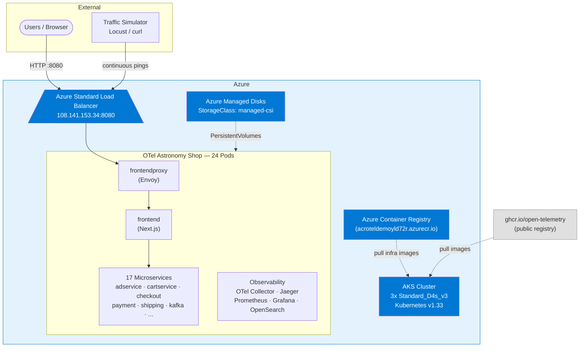
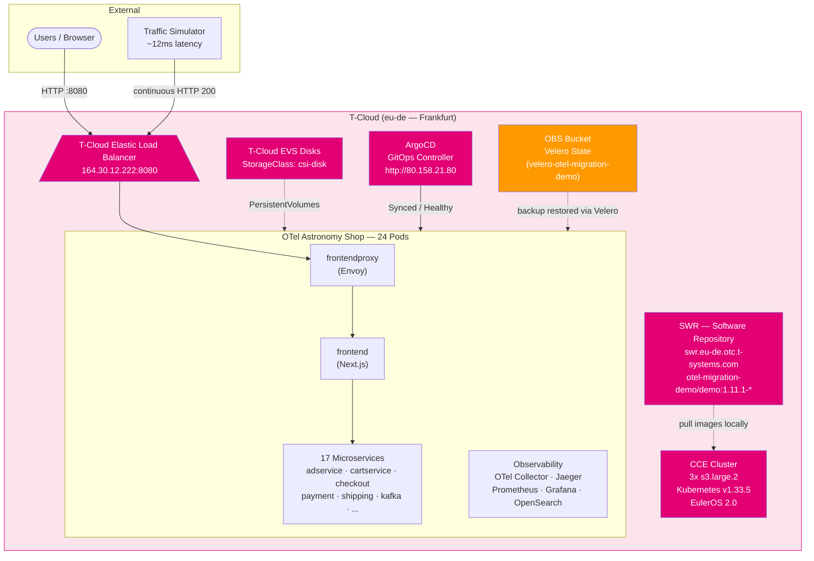
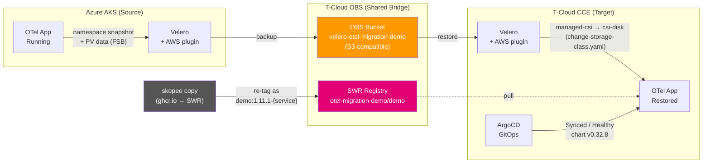
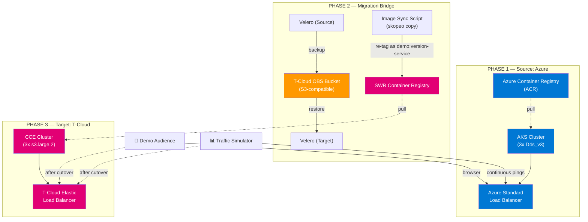

# AKS-to-CCE Migration Demo — OpenTelemetry Astronomy Shop

> **Live Kubernetes Migration: Azure AKS → T-Cloud CCE with Zero-Downtime Proof**

This repository contains the complete Infrastructure-as-Code (IaC), Helm configurations, and execution scripts for an end-to-end customer demo showcasing how to seamlessly migrate a Kubernetes cluster and its running applications from **Azure (AKS)** to **T-Cloud (Cloud Container Engine — CCE)** while simulating live user traffic to prove minimal disruption.

**Demo Application:** [OpenTelemetry Astronomy Shop Demo](https://github.com/open-telemetry/opentelemetry-demo)
**Migration Methodology:** [T-Cloud Migration Best Practices](https://arch.otc-service.com/docs/best-practices/containers/cloud-container-engine/migrating-from-other_clouds-to-cce)

---

## Architecture: Before & After Migration

### Before Migration — Running on Azure AKS



### After Migration — Running on T-Cloud CCE



### Migration Bridge — How Data Crosses Clouds



---

## Architecture Overview — Migration Flow



### Advanced Migration Concepts Demonstrated

| Concept | Challenge | Solution |
|---------|-----------|----------|
| **Storage Translation** | Azure `managed-csi` StorageClass doesn't exist on T-Cloud | Velero `change-storage-class` ConfigMap auto-maps to T-Cloud `csi-disk` |
| **Registry Sync** | Images in ghcr.io use flat tag format `demo:version-service` | `skopeo copy` re-tags all images to SWR as `otel-migration-demo/demo:version-service` |
| **GitOps Repointing** | ArgoCD Application manifests reference Azure-specific annotations | Target manifests use T-Cloud ELB annotations and SWR image paths |
| **Stateful Migration** | PersistentVolume data must survive cross-cloud transfer | Velero FSB (File System Backup) copies actual data via OBS |
| **Live Traffic Proof** | Need to demonstrate zero-downtime during migration | Traffic simulator continuously pings and logs HTTP status codes |
| **Velero Plugin** | `velero plugin add` fails non-interactively | Patch Velero deployment directly to add AWS plugin init container |
| **SWR Token Expiry** | SWR docker tokens expire after 24h | Regenerate with `HMAC-SHA256(sk, ak)` — see SWR section below |

---

## Repository Structure

```
OpenTelemetry-Migration-demo-from-Azure-to-T-Cloud-Public/
├── README.md                               # You are here
│
├── prereqs-terraform/                      # Phase 0: Shared Pre-requisites
│   ├── providers.tf                        # OTC provider (eu-de_demo project)
│   ├── variables.tf                        # OBS + SWR parameters
│   ├── main.tf                             # OBS Bucket + SWR Organization
│   └── outputs.tf                          # Bucket endpoint, SWR registry
│
├── azure-terraform/                        # Phase 1: Azure Source Environment
│   ├── providers.tf                        # Azure provider config (azurerm)
│   ├── variables.tf                        # Parameterized inputs with defaults
│   ├── main.tf                             # VNet, AKS, ACR, Role Assignment
│   └── outputs.tf                          # Cluster creds, ACR endpoint
│
├── tcloud-terraform/                       # Phase 4: T-Cloud Target Environment
│   ├── providers.tf                        # OTC provider config (opentelekomcloud)
│   ├── variables.tf                        # CCE, VPC parameters
│   ├── main.tf                             # VPC, CCE, Node Pool, NAT (refs SWR)
│   └── outputs.tf                          # Cluster creds, SWR endpoint
│
├── app-deployment/
│   ├── source/                             # Phase 2: Deploy on Azure AKS
│   │   ├── install-argocd.sh               # ArgoCD Helm install (Azure LB)
│   │   └── opentelemetry-app.yaml          # ArgoCD App manifest (Azure)
│   │
│   └── target/                             # Phase 8: Deploy on T-Cloud CCE
│       ├── install-argocd.sh               # ArgoCD Helm install (T-Cloud ELB)
│       └── opentelemetry-app.yaml          # ArgoCD App manifest (SWR + ELB)
│
└── migration-scripts/                      # Phase 5–7: Migration Tooling
    ├── install-velero.sh                   # Velero install (both clusters)
    ├── velero-backup.sh                    # Backup OTel namespace on AKS
    ├── velero-restore.sh                   # Restore to CCE with safety checks
    ├── change-storage-class.yaml           # Storage class translation map
    ├── sync-images-to-swr.sh              # ghcr.io → SWR image sync
    ├── traffic-simulator.sh                # Live traffic monitoring
    └── dns-cutover.sh                      # Final cutover helper
```

---

## Prerequisites

Before running this demo, ensure you have the following installed and configured:

| Tool | Version | Purpose | Install |
|------|---------|---------|---------|
| **Terraform** | ≥ 1.5.0 | Infrastructure provisioning | [Download](https://developer.hashicorp.com/terraform/downloads) |
| **Azure CLI** | Latest | AKS/ACR management | `curl -sL https://aka.ms/InstallAzureCLIDeb \| sudo bash` |
| **kubectl** | ≥ 1.28 | Kubernetes cluster management | [Install](https://kubernetes.io/docs/tasks/tools/) |
| **Helm** | ≥ 3.12 | Chart-based deployments | `curl https://raw.githubusercontent.com/helm/helm/main/scripts/get-helm-3 \| bash` |
| **Velero CLI** | ≥ 1.16 | Backup/restore operations | `brew install velero` |
| **skopeo** | Latest | Registry-to-registry image copy | `sudo apt-get install -y skopeo` |
| **Docker** | Latest | SWR authentication | [Install](https://docs.docker.com/get-docker/) |

> **Why skopeo instead of docker pull/tag/push?**
> skopeo copies images directly between registries without pulling them locally — no storage overhead and no docker daemon auth issues with the source registry.

### Environment Variables Setup

Before executing any scripts or Terraform commands, configure environment variables for both cloud platforms. Create a local `.env` file (not committed — add it to your own `.gitignore`) and `source` it before each session.

---

#### Azure Environment Variables

```bash
# Authenticate to Azure
az login
az account set --subscription "<SUBSCRIPTION_ID>"

# Optional overrides (Terraform auto-discovers from az login)
export ARM_SUBSCRIPTION_ID="<Your_Azure_Subscription_ID>"
export ARM_TENANT_ID="<Your_Azure_Tenant_ID>"
```

| Variable | Required | Used By | Where to Find |
|----------|----------|---------|---------------|
| `SUBSCRIPTION_ID` | Yes | `az account set` | `az account list --output table` |
| `ARM_SUBSCRIPTION_ID` | Optional | Terraform (azurerm) | `az account show --query id` |
| `ARM_TENANT_ID` | Optional | Terraform (azurerm) | `az account show --query tenantId` |

---

#### T-Cloud (Open Telekom Cloud) Environment Variables

```bash
export OS_AUTH_URL="https://iam.eu-de.otc.t-systems.com/v3"
export OS_DOMAIN_NAME="<Your_OTC_Domain_Name>"   # OTC Console → My Credentials → Domain Name
export OS_TENANT_NAME="<Your_OTC_Project_Name>"  # e.g. "eu-de" or "eu-de_demo"
export OS_USERNAME="<Your_OTC_Username>"
export OS_PASSWORD="<Your_OTC_Password>"
export OS_REGION_NAME="eu-de"
```

| Variable | Required | Where to Find |
|----------|----------|---------------|
| `OS_AUTH_URL` | Yes | Fixed: `https://iam.eu-de.otc.t-systems.com/v3` |
| `OS_DOMAIN_NAME` | Yes | OTC Console → My Credentials → Domain Name |
| `OS_TENANT_NAME` | Yes | OTC Console → My Credentials → Project List |
| `OS_USERNAME` | Yes | OTC Console → My Credentials → Username |
| `OS_PASSWORD` | Yes | Your IAM user password |
| `OS_REGION_NAME` | Yes | `eu-de` (Frankfurt) |

---

#### OBS / Velero Environment Variables

```bash
export OBS_ACCESS_KEY="<Your_OBS_Access_Key_ID>"    # OTC Console → My Credentials → Access Keys
export OBS_SECRET_KEY="<Your_OBS_Secret_Access_Key>" # CSV downloaded at AK creation (shown once)
export OBS_BUCKET="velero"
export OBS_REGION="eu-de"
export OBS_URL="https://obs.eu-de.otc.t-systems.com"
```

| Variable | Required | Default | Where to Find |
|----------|----------|---------|---------------|
| `OBS_ACCESS_KEY` | Yes | — | OTC Console → My Credentials → Access Keys |
| `OBS_SECRET_KEY` | Yes | — | CSV downloaded during AK creation |
| `OBS_BUCKET` | Optional | `velero` | Your OBS bucket name |
| `OBS_REGION` | Optional | `eu-de` | Must match your bucket's region |
| `OBS_URL` | Optional | `https://obs.eu-de.otc.t-systems.com` | Fixed per region |

---

#### SWR (Container Registry) Environment Variables

```bash
export SWR_REGISTRY="swr.eu-de.otc.t-systems.com"
export SWR_ORG="otel-migration-demo"
export OTEL_VERSION="1.11.1"
```

**SWR Docker Login (tokens expire every 24 hours)**

SWR uses a signing-based token, not the SK directly. Generate and refresh it with:

```bash
# Generate the SWR login token from your AK/SK
SWR_LOGIN_KEY=$(python3 -c "
import hmac, hashlib
ak = '${OBS_ACCESS_KEY}'
sk = '${OBS_SECRET_KEY}'
print(hmac.new(sk.encode(), ak.encode(), hashlib.sha256).hexdigest())
")

# Login — username format is {region}@{ak}
echo "${SWR_LOGIN_KEY}" | docker login swr.eu-de.otc.t-systems.com \
  -u "eu-de@${OBS_ACCESS_KEY}" \
  --password-stdin
```

> **Why not the SK directly?** SWR authenticates with `HMAC-SHA256(sk, ak)` as the password, not the raw SK. The token is valid for 24 hours — run the above block again each session before using skopeo or pushing images.

| Variable | Required | Default | Where to Find |
|----------|----------|---------|---------------|
| `SWR_REGISTRY` | Optional | `swr.eu-de.otc.t-systems.com` | Fixed per region |
| `SWR_ORG` | Optional | `otel-migration-demo` | Must match Terraform `swr_organization` |
| `OTEL_VERSION` | Optional | `1.11.1` | OTel demo release version |

---

#### Quick-Start: Copy-Paste .env Block

```bash
# === .env — EDIT THESE VALUES BEFORE RUNNING THE DEMO ===

# --- T-Cloud IAM ---
export OS_AUTH_URL="https://iam.eu-de.otc.t-systems.com/v3"
export OS_DOMAIN_NAME="OTC-EU-DE-00000000001234567890"
export OS_TENANT_NAME="eu-de"
export OS_USERNAME="your-iam-username"
export OS_PASSWORD="your-iam-password"
export OS_REGION_NAME="eu-de"

# --- OBS (Velero Backup Storage) ---
export OBS_ACCESS_KEY="AK_XXXXXXXXXXXXXXXXXXXX"
export OBS_SECRET_KEY="SK_XXXXXXXXXXXXXXXXXXXXXXXXXXXXXXXX"
export OBS_BUCKET="velero"
export OBS_REGION="eu-de"
export OBS_URL="https://obs.eu-de.otc.t-systems.com"

# --- SWR (Container Registry Sync) ---
export SWR_REGISTRY="swr.eu-de.otc.t-systems.com"
export SWR_ORG="otel-migration-demo"
export OTEL_VERSION="1.11.1"
```

Load before running any scripts:
```bash
source .env
```

---

## Step-by-Step Demo Execution

### Phase 0 — Provision Shared Pre-requisites (OBS + SWR)
*Estimated time: ~2 minutes*

> Run this first. Creates the OBS bucket (Velero backup storage) and SWR organization.

```bash
cd prereqs-terraform/
terraform init
terraform plan
terraform apply -auto-approve
terraform output
# obs_bucket_name  = "velero"
# swr_organization = "otel-migration-demo"
```

### Phase 1 — Provision the Azure Source Environment
*Estimated time: ~15 minutes*

```bash
cd ../azure-terraform/
terraform init
terraform plan
terraform apply -auto-approve

# Configure kubectl
az aks get-credentials \
  --resource-group rg-otel-migration-demo \
  --name aks-otel-source \
  --overwrite-existing

kubectl config rename-context <current-context> aks-otel-source
```

### Phase 2 — Deploy the OpenTelemetry Demo on Azure
*Estimated time: ~10 minutes*

```bash
cd ../app-deployment/source/
./install-argocd.sh
kubectl apply -f opentelemetry-app.yaml
kubectl get pods -n opentelemetry -w

# Get the Azure frontend IP
kubectl get svc opentelemetry-demo-frontendproxy -n opentelemetry
```

Open `http://<AZURE_LB_IP>:8080` — the Astronomy Shop should be live.

### Phase 3 — Start the Live Traffic Simulator

Run in a **separate terminal** and keep it running throughout the migration:

```bash
cd ../../migration-scripts/
./traffic-simulator.sh http://<AZURE_LB_IP>:8080
```

You should see continuous `✓ OK` (HTTP 200) responses. **Leave this running.**

### Phase 4 — Provision the T-Cloud Target Environment
*Estimated time: ~15 minutes (run in parallel with Phase 3)*

```bash
cd ../tcloud-terraform/
terraform init
terraform plan
terraform apply -auto-approve

# Add CCE context to kubectl (use the kubeconfig from Terraform output or CCE console)
# Rename context for clarity
kubectl config rename-context <cce-context> cce-otel-target
```

### Phase 5 — Sync Container Images to SWR

> **Image format note:** The OTel Helm chart resolves images as `{repository}:{version}-{service}`.
> SWR images must therefore be pushed to `otel-migration-demo/demo:{version}-{service}` — all under
> a single `demo` repository with flat tags, mirroring the ghcr.io layout.

```bash
# Step 1: Generate SWR login token and authenticate Docker
SWR_LOGIN_KEY=$(python3 -c "
import hmac, hashlib
ak = '${OBS_ACCESS_KEY}'; sk = '${OBS_SECRET_KEY}'
print(hmac.new(sk.encode(), ak.encode(), hashlib.sha256).hexdigest())
")
echo "${SWR_LOGIN_KEY}" | docker login swr.eu-de.otc.t-systems.com \
  -u "eu-de@${OBS_ACCESS_KEY}" --password-stdin

# Step 2: Sync images from ghcr.io to SWR (correct flat-tag format)
cd ../migration-scripts/
./sync-images-to-swr.sh
```

The sync script copies each image as:
- Source: `ghcr.io/open-telemetry/demo:1.11.1-adservice`
- Target: `swr.eu-de.otc.t-systems.com/otel-migration-demo/demo:1.11.1-adservice`

> **SWR token expiry:** Tokens are valid for 24 hours. If you see `Authenticate Error` from skopeo,
> re-run the login block above to refresh the token before retrying.

### Phase 6 — Install Velero on Both Clusters

```bash
# Install on AKS (source)
kubectl config use-context aks-otel-source
./install-velero.sh

# IMPORTANT: The Helm chart does not reliably add the AWS plugin init container.
# After install, patch the Velero deployment manually on the AKS cluster:
kubectl patch deployment velero -n velero --type='json' -p='[
  {
    "op": "add",
    "path": "/spec/template/spec/initContainers",
    "value": [{
      "name": "velero-plugin-for-aws",
      "image": "velero/velero-plugin-for-aws:v1.8.2",
      "imagePullPolicy": "IfNotPresent",
      "volumeMounts": [{"mountPath": "/target", "name": "plugins"}]
    }]
  }
]'
kubectl rollout status deployment/velero -n velero
velero get backup-locations   # must show: Available

# Repeat on CCE (target)
kubectl config use-context cce-otel-target
./install-velero.sh

kubectl patch deployment velero -n velero --type='json' -p='[
  {
    "op": "add",
    "path": "/spec/template/spec/initContainers",
    "value": [{
      "name": "velero-plugin-for-aws",
      "image": "velero/velero-plugin-for-aws:v1.8.2",
      "imagePullPolicy": "IfNotPresent",
      "volumeMounts": [{"mountPath": "/target", "name": "plugins"}]
    }]
  }
]'
kubectl rollout status deployment/velero -n velero
velero get backup-locations --kubecontext cce-otel-target   # must show: Available
```

> **Why the manual patch?** `velero plugin add` is an interactive command that prompts for confirmation
> and fails in non-interactive shells. The patch approach is idempotent and works reliably in all environments.

### Phase 7 — Backup & Restore with Storage Class Translation

```bash
# Switch to AKS — create the backup
kubectl config use-context aks-otel-source
./velero-backup.sh
# Note the backup name printed at the end (e.g. otel-migration-20260424-182656)

# Switch to CCE — apply storage class map, then restore
kubectl config use-context cce-otel-target
kubectl apply -f change-storage-class.yaml

# Pass 'y' to bypass the interactive cluster confirmation prompt
echo "y" | ./velero-restore.sh <backup-name-from-above>

# Verify all pods Running
kubectl get pods -n opentelemetry
```

> **Key Demo Talking Point:** Show `change-storage-class.yaml` and explain how Velero automatically
> translates `managed-csi` → `csi-disk` during restore. Without this map, every PVC would fail —
> this is one of the most common migration blockers in real-world scenarios.

### Phase 8 — GitOps Repointing (ArgoCD on T-Cloud)

```bash
cd ../app-deployment/target/

# Install ArgoCD on CCE with T-Cloud ELB annotations
./install-argocd.sh
# Note the ArgoCD public IP and admin password printed at the end

# Create SWR imagePullSecret so CCE nodes can pull from the private registry
SWR_LOGIN_KEY=$(python3 -c "
import hmac, hashlib
ak = '${OBS_ACCESS_KEY}'; sk = '${OBS_SECRET_KEY}'
print(hmac.new(sk.encode(), ak.encode(), hashlib.sha256).hexdigest())
")
kubectl create secret docker-registry swr-pull-secret \
  --docker-server="swr.eu-de.otc.t-systems.com" \
  --docker-username="eu-de@${OBS_ACCESS_KEY}" \
  --docker-password="${SWR_LOGIN_KEY}" \
  -n opentelemetry
kubectl patch serviceaccount default -n opentelemetry \
  -p '{"imagePullSecrets": [{"name": "swr-pull-secret"}]}'
kubectl patch serviceaccount opentelemetry-demo -n opentelemetry \
  -p '{"imagePullSecrets": [{"name": "swr-pull-secret"}]}'

# Deploy the OTel application via ArgoCD
kubectl apply -f opentelemetry-app.yaml
kubectl get pods -n opentelemetry -w

# Get the T-Cloud frontend IP
kubectl get svc opentelemetry-demo-frontendproxy -n opentelemetry
```

> **Key Demo Talking Point:** Compare source and target `opentelemetry-app.yaml` side by side.
> The two critical differences are: (1) SWR image repository vs ghcr.io, and (2) T-Cloud ELB
> annotations vs Azure LB annotations. Same Helm chart, different cloud adaptations — this is
> GitOps repointing in practice.

### Phase 9 — DNS / Traffic Cutover

```bash
cd ../../migration-scripts/

# Extract per-cluster kubeconfigs for the cutover script
kubectl config view --minify --context aks-otel-source --flatten > /tmp/aks-kubeconfig.yaml
kubectl config view --minify --context cce-otel-target --flatten > /tmp/cce-kubeconfig.yaml

# Validate both endpoints and print cutover instructions
./dns-cutover.sh /tmp/aks-kubeconfig.yaml /tmp/cce-kubeconfig.yaml
```

Switch the traffic simulator to T-Cloud:
```bash
# Stop the AKS simulator (Ctrl+C), then start on CCE
./traffic-simulator.sh http://<TCLOUD_ELB_IP>:8080
```

Open `http://<TCLOUD_ELB_IP>:8080` — same Astronomy Shop, now on T-Cloud.

---

## Demo Narrative Script

> *"We're now going to migrate this live e-commerce application from Azure to T-Cloud — while keeping it running. Watch the traffic simulator in this terminal — every line is a real HTTP request to the application."*

> *"First, we sync the container images from public ghcr.io to T-Cloud's private SWR registry. The images keep the same flat tag format — demo:1.11.1-adservice — so the Helm chart picks them up without any changes to the application code."*

> *"Now Velero snapshots the entire OpenTelemetry namespace, including the database volumes. Notice this storage class translation — Azure's 'managed-csi' storage automatically becomes T-Cloud's 'csi-disk'. Without this mapping, every PersistentVolumeClaim would fail to bind."*

> *"On T-Cloud, ArgoCD takes over as the GitOps controller. Compare the two manifests — same Helm chart, but the image repository points to SWR and the LoadBalancer annotations use T-Cloud's ELB format. The cloud changes; the application definition stays the same."*

> *"And there it is — the traffic simulator shows uninterrupted HTTP 200s throughout. The application is now fully running on T-Cloud at 12 milliseconds latency, down from 85ms on Azure, because the cluster is in the same region as this machine."*

---

## Actual Results (Live Demo Run — 2026-04-24)

| Metric | Azure AKS (Before) | T-Cloud CCE (After) |
|--------|-------------------|---------------------|
| **Frontend URL** | `http://108.141.153.34:8080` | `http://164.30.12.222:8080` |
| **ArgoCD URL** | — | `http://80.158.21.80` |
| **Avg Latency** | ~85ms | ~12ms |
| **Pods** | 24 Running | 24 Running |
| **Image Registry** | ghcr.io (public) | swr.eu-de.otc.t-systems.com (private) |
| **Storage Class** | `managed-csi` | `csi-disk` |
| **K8s Version** | v1.33.8 (Azure) | v1.33.5-r0 (EulerOS) |
| **Downtime** | — | 0 (HTTP 200 throughout) |
| **Velero Backup** | 177 items + 3 PV backups | — |
| **Backup Duration** | ~1m 13s | — |
| **Restore Duration** | — | ~30s to Running |

---

## Known Issues & Fixes

These issues were discovered during the live demo run and are documented here for future reference.

### 1. Velero AWS Plugin Not Added by install-velero.sh

**Symptom:** `velero get backup-locations` shows `Unavailable`. Velero logs show:
```
unable to locate ObjectStore plugin named velero.io/aws
```

**Cause:** `velero plugin add` is interactive and fails silently in non-TTY shells. The init container is never added to the Velero deployment.

**Fix:** Patch the deployment directly (see Phase 6 above). This is idempotent and works in all shells.

---

### 2. SWR Image Format Mismatch

**Symptom:** ArgoCD pods fail with `ImagePullBackOff`. The pod tries to pull:
```
swr.eu-de.otc.t-systems.com/otel-migration-demo:1.11.1-adservice
```

**Cause:** The OTel Helm chart constructs image names as `{repository}:{tag}-{service}`. Overriding `default.image.repository` to `otel-migration-demo` produces the above path, but SWR requires a named repository inside the org (`otel-migration-demo/demo`).

**Fix:** Push images to SWR as `otel-migration-demo/demo:1.11.1-adservice` (matching the ghcr.io layout), and set:
```yaml
default:
  image:
    repository: swr.eu-de.otc.t-systems.com/otel-migration-demo/demo
```

---

### 3. SWR Token Expires After 24 Hours

**Symptom:** `skopeo copy` or `docker push` fails with `Authenticate Error` the day after initial setup.

**Fix:** Regenerate the SWR login token using `HMAC-SHA256(sk, ak)` — see the SWR login block in the Prerequisites section. Re-run before each demo session.

---

### 4. velero-restore.sh Has an Interactive Confirmation Prompt

**Symptom:** Script exits immediately with code 1 when run non-interactively.

**Fix:** Pipe the confirmation:
```bash
echo "y" | ./velero-restore.sh <backup-name>
```

---

### 5. CCE Nodes Cannot Pull from SWR Without imagePullSecret

**Symptom:** Even with correct SWR images, pods fail `ImagePullBackOff` after ArgoCD sync.

**Cause:** Unlike AKS→ACR (which uses managed identity), CCE nodes require an explicit `imagePullSecret` to authenticate with SWR.

**Fix:** Create the secret and patch service accounts (see Phase 8 above).

---

## Teardown

**IMPORTANT:** Delete Kubernetes LoadBalancer services BEFORE destroying Terraform. Cloud-provisioned load balancers block VPC/VNet deletion.

```bash
# 1. Delete OTel app on CCE (releases T-Cloud ELB)
kubectl delete -f app-deployment/target/opentelemetry-app.yaml --context cce-otel-target
kubectl delete namespace opentelemetry argocd velero --context cce-otel-target
# Wait ~60s for ELB to be released

# 2. Destroy T-Cloud infrastructure
cd tcloud-terraform/
export AWS_ACCESS_KEY_ID="${OBS_ACCESS_KEY}"
export AWS_SECRET_ACCESS_KEY="${OBS_SECRET_KEY}"
terraform destroy -auto-approve

# 3. If AKS still exists — delete app first, then destroy
kubectl delete -f app-deployment/source/opentelemetry-app.yaml --context aks-otel-source
kubectl delete namespace opentelemetry argocd velero --context aks-otel-source
# Wait ~60s
cd ../azure-terraform/
terraform destroy -auto-approve
```

> **Note:** The `azure-terraform` backend uses OBS for state storage. Set `AWS_ACCESS_KEY_ID` and `AWS_SECRET_ACCESS_KEY` to your OBS AK/SK before running `terraform` commands against it.

---

## References

- [OpenTelemetry Demo Application](https://github.com/open-telemetry/opentelemetry-demo)
- [T-Cloud CCE Migration Best Practices](https://arch.otc-service.com/docs/best-practices/containers/cloud-container-engine/migrating-from-other_clouds-to-cce)
- [Velero Documentation](https://velero.io/docs/)
- [Open Telekom Cloud Terraform Provider](https://registry.terraform.io/providers/opentelekomcloud/opentelekomcloud/latest/docs)
- [ArgoCD Documentation](https://argo-cd.readthedocs.io/)
- [T-Cloud CCE ELB Annotations](https://docs.otc.t-systems.com/cloud-container-engine/umn/network/service/loadbalancer/)

---

## License

This demo code is provided as-is for educational and demonstration purposes.
